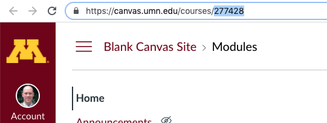
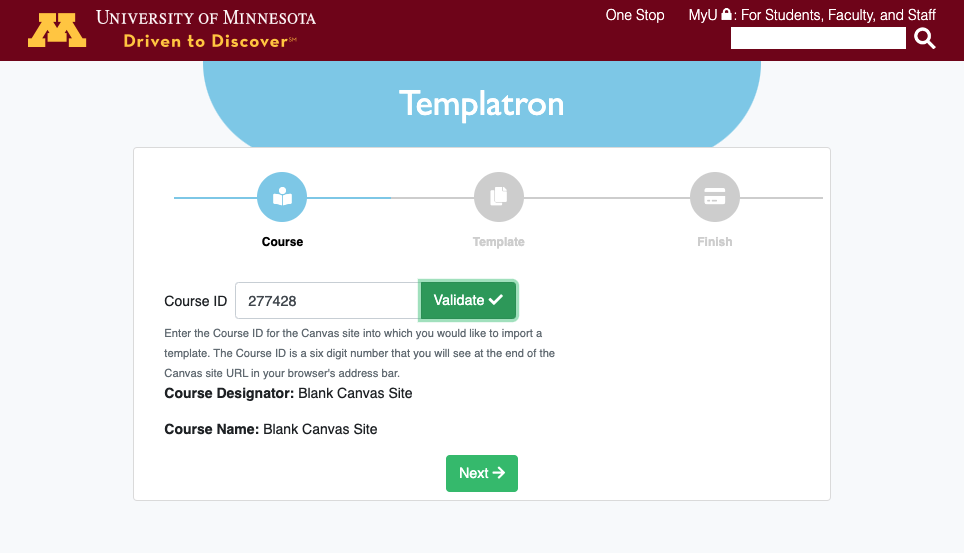
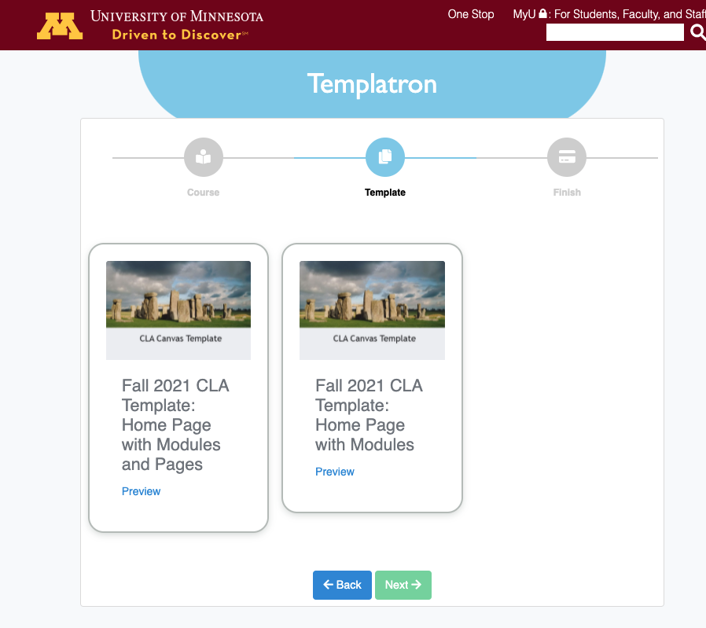
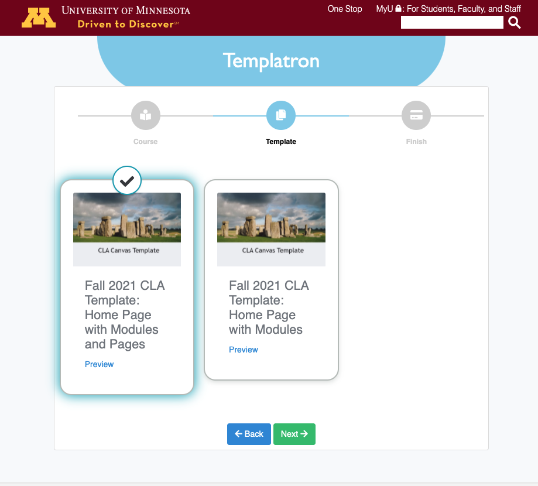
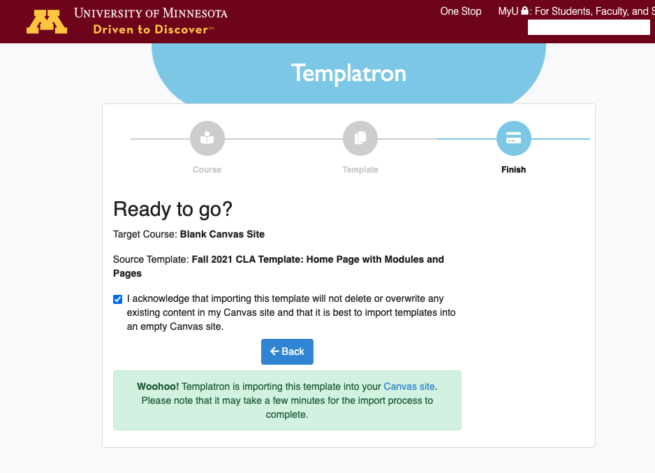

# Welcome to Templatron
Templatron is a simple tool for selecting and importing a template into any University of Minnesota Canvas site in which you are a Teacher or a Designer. 

<iframe width="100%" height="400" src="https://www.youtube.com/embed/xzqQxj3vCTk" title="YouTube video player" frameborder="0" allow="accelerometer; autoplay; clipboard-write; encrypted-media; gyroscope; picture-in-picture" allowfullscreen></iframe>

## Using Templatron
We recommend opening two tabs in a web browser to begin. Log into Canvas in the first browser and navigate to the Canvas site into which you want to import a template. We recommend that you only import templates into Canvas sites that have no content yet.

### Copying the Course ID
Copy the Course ID (the series of digits at the end of the course URL) from the browser address bar. You will need that to import a template using Templatron.

### Validating Your Site
In your second browser tab, go to the Templatron website and log in with your University of Minnesota username and password.

Once you have logged in, type or paste the Course ID into the Course ID field and click the ‘Validate’ button. This step will confirm the name of the course and validate that you are a Teacher or Designer in it.

Click the ‘Next’ button.

### Previewing and Selecting a Template
The next screen will display all templates that are available for you to import into your site. Note that you can preview and explore any of the templates by clicking the respective ‘Preview’ link.

Once you have chosen a template, click to select it and then click the ‘Next’ button.

### Starting the Import Process
The final screen will display the course into which you are importing a template, the template you selecte, and there will be a statement acknowledging that you understand that importing a template will not overwrite any content that already exists in your Canvas site. Check the checkbox and click ‘Import!’ to begin the import process.

After you begin the import process, you can click the link to go directly to your site. Note that it might take a minute or two to run and complete the import process.

